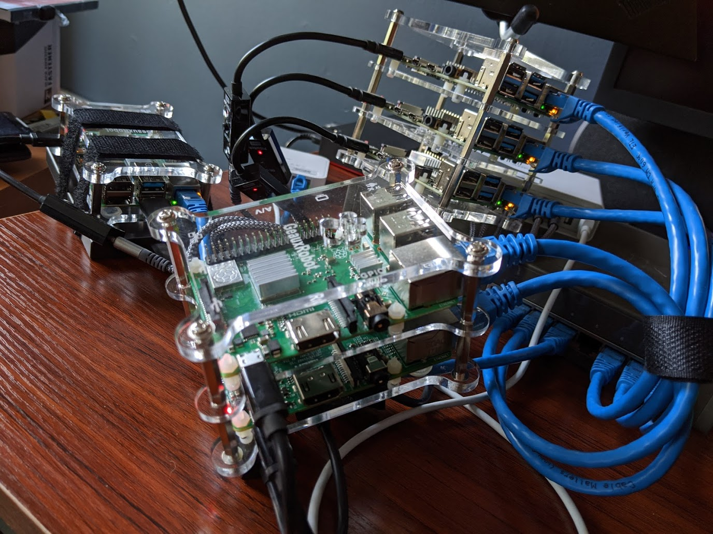

# Identify a Raspberry Pi in your RPi cluster with a flashing LED

We've all been there. "I'm going to get this Raspberry Pi to try out. They look kinda cool." And then, like tribbles on an Enterprise, all of the sudden there are [Kubernetes clusters](https://opensource.com/article/20/5/kubernetes-raspberry-pi), [NFS Servers](https://opensource.com/article/20/5/nfs-raspberry-pi), and [TOR Proxies](https://opensource.com/article/20/4/tor-proxy-raspberry-pi).

Maybe even a [hotel booking system](https://opensource.com/article/20/4/qloapps-raspberry-pi)!

Pies cover the desk. They spill out onto the floor. Carrier boards for Raspberry Pi Computer Modules installed into lunchboxes litter the shelves.

...or maybe that's just me?

I bet if you have one Raspberry Pi, you've got _at least_ two others, though, and gosh darn it, they all look the same.

This was the situation I found myself it recently, testing an NFS server setup on one of my Raspberry Pis. I needed to plug in a USB hard drive, but ... to which one? Ol' Lingonberry Pi was the chosen host, and I was SSH'd in her, but which actual, _physical_ RPi was she? There was no way of knowing...

Or was there?


_So, so many Raspberry Pis. Which one is Lingonberry?_

At a previous job I had cause to go to our datacenters to work on servers there, and some of them had this neat feature: an ID button on the front of the server started an LED flashing on both the front and back of the server. If I needed to deal with the other side of the server, I could press the ID button, then walk allllll they way around to the other side of the rack, and still be able to find the right server.

I needed something like this to find Lingonberry.

There aren't any buttons on the Pis, but there are LEDs, and after a quick Google search, I learned that [one of them is _controllable_](https://www.raspberrypi.org/forums/viewtopic.php?t=12530). _Cue maniacal laughter_

There are three important bits to know. First, the LED path: on Raspberry Pis, at least those running Ubuntu 20.04, the front (and user-controllable) LED is found at `/sys/class/leds/led0`. If you navigate to it, you'll find that it is a symlink to a directory that has a number of files in it. The two important files are `trigger` and `brightness`.

The `trigger` file controls what lights up the LED. If you cat that file, you will find a list:

```txt
none usb-gadget usb-host rc-feedback rfkill-any rfkill-none kbd-scrolllock kbd-numlock kbd-capslock kbd-kanalock kbd-shiftlock kbd-altgrlock kbd-ctrllock kbd-altlock kbd-shiftllock kbd-shiftrlock kbd-ctrlllock kbd-ctrlrlock timer oneshot disk-activity disk-read disk-write ide-disk mtd nand-disk heartbeat backlight gpio cpu cpu0 cpu1 cpu2 cpu3 default-on input panic mmc1 [mmc0] bluetooth-power rfkill0 unimac-mdio--19:01:link unimac-mdio--19:01:1Gbps unimac-mdio--19:01:100Mbps unimac-mdio--19:01:10Mbps
```

The item in brackets, `[mmc0]` in the example above, is what the LED is currently being triggered by, and is the disk activity for the SD card plugged into the Raspberry Pi. The trigger file isn't a normal file, though. Rather than editing it directly, you change the trigger by echoing one of the triggers into the file.

To identify Lingonberry, I needed to temporarily disable the `[mmc0]` trigger, so I could make the LED work how _I_ wanted it to work. In the script, we disable all the triggers by echoing "none" into the trigger file:

```shell
# You must be root to do this
$ echo none >trigger

$ cat trigger
[none] usb-gadget usb-host rc-feedback rfkill-any rfkill-none kbd-scrolllock kbd-numlock kbd-capslock kbd-kanalock kbd-shiftlock kbd-altgrlock kbd-ctrllock kbd-altlock kbd-shiftllock kbd-shiftrlock kbd-ctrlllock kbd-ctrlrlock timer oneshot disk-activity disk-read disk-write ide-disk mtd nand-disk heartbeat backlight gpio cpu cpu0 cpu1 cpu2 cpu3 default-on input panic mmc1 mmc0 bluetooth-power rfkill0 unimac-mdio--19:01:link unimac-mdio--19:01:1Gbps unimac-mdio--19:01:100Mbps unimac-mdio--19:01:10Mbps
```

You see from the contents of the trigger file above that `[none]` is now the selected trigger. And at this point the LED is off, and not flashing.

Next is the `brightness` file. You can control whether the LED is on or off by echoing either 0 or 1 into the file. By alternating 1 and 0, we can make the LED blink, and doing it with a one second sleep in the middle produces a regular on/off blink unlike any of the activity that would otherwise be triggering the LED. This is perfect for identifying the Raspberry Pi.

Finally, if you do not set the trigger file back to a trigger, then it remains off. That's not what we want most of the time - it's better to see the disk activity. This means we have to make sure that any script we write will reset the trigger when its done, or if it is interrupted! That calls for a [signal trap](https://tldp.org/LDP/Bash-Beginners-Guide/html/sect_12_02.html).  A trap will capture the SIGINT or SIGTERM (or other) signals, and execute some code before quitting. This way, if the script is interrupted - say by you pressing CTRL-C to stop it - it can still reset the trigger.

With this new-found knowledge, I was able to bang out a script pretty quickly, and toss it onto my Raspberry Pis:

```shell
#!/bin/sh

set -o errexit
set -o nounset

trap quit INT TERM

COUNT=0

if ! [ $(id -u) = 0 ]; then
   echo "Must be run as root."
   exit 1
fi

LED="/sys/class/leds/led0"

if [[ ! -d $LED ]]
then
  echo "Could not find an LED at ${LED}"
  echo "Perhaps try '/sys/class/leds/ACT'?"
  exit 1
fi

function quit() {
  echo mmc0 >"${LED}/trigger"
}

echo -n "Blinking Raspberry Pi's LED - press CTRL-C to quit"

echo none >"${LED}/trigger"

while true
do
  let "COUNT=COUNT+1"
  if [[ $COUNT -lt 30 ]]
  then
    echo 1 >"${LED}/brightness"
    sleep 1
    echo 0 >"${LED}/brightness"
    sleep 1
  else
    quit
    break
  fi
done
```

This script checks that the LED control directory exists, disables the `[mmc0]` trigger, and then starts a loop blinking the LED on and off every second. It also includes a trap to catch `INT` and `TERM` signals, and resets the trigger. I copied this script onto all my Raspberry Pis, and any time I need to identify one of them, I just run it. It worked perfectly to identify Ol' Lingonberry so I could setup the disks for the NFS server, and I've used it a number of times since then.

One thing to note - it's possible that the path to the LED may be different in other distributions.  There are also other LEDs in the `/sys/class/leds` directory, but they are not controllable by the user - they are hooked into different bits of the firmware of the Raspberry Pi.

Do you have any cool Raspberry Pi tricks? Let me know in the comments! I'm always interested in learning what other people do with their infestation of Pis!
